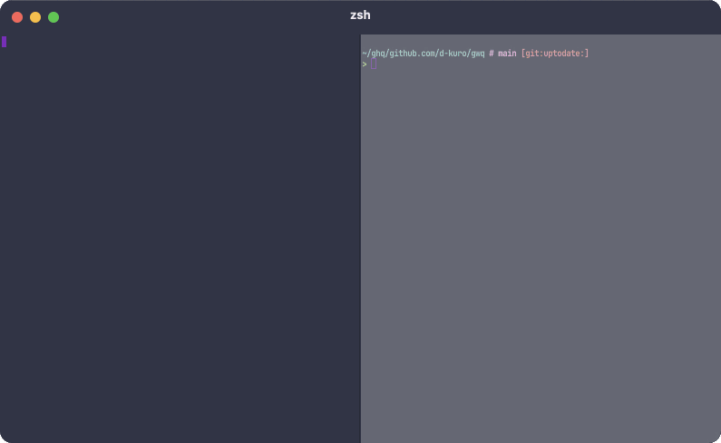

# gwq - Git Worktree Manager

`gwq` is a CLI tool for efficiently managing Git worktrees. Like how `ghq` manages repository clones, `gwq` provides intuitive operations for creating, switching, and deleting worktrees using a fuzzy finder interface.



## Why gwq?

Git worktrees allow you to check out multiple branches from the same repository into separate directories. This is particularly powerful when:

- Working on multiple features simultaneously
- Running parallel AI coding agents on different tasks
- Reviewing code while developing new features
- Testing changes without disrupting your main workspace

### AI Coding Agent Workflows

One of the most powerful applications of `gwq` is enabling parallel AI coding workflows. Instead of having a single AI agent work sequentially through tasks, you can leverage multiple worktrees to have multiple AI agents work on different parts of your project simultaneously:

```bash
# Create worktrees for parallel development
gwq add -b feature/authentication
gwq add -b feature/data-visualization
gwq add -b bugfix/login-issue

# Each AI agent can work in its own worktree
cd $(gwq get authentication) && claude
cd $(gwq get visualization) && claude
cd $(gwq get login) && claude

# Monitor all agent activity in real-time
gwq status --watch
```

Since each worktree has its own working directory with isolated files, AI agents can work at full speed without merge conflicts. This approach is ideal for independent tasks, parallel migrations, and code review workflows.

## Installation

### Using Go
```bash
go install github.com/d-kuro/gwq/cmd/gwq@latest
```

### From Source
```bash
git clone https://github.com/d-kuro/gwq.git
cd gwq
go build -o gwq ./cmd/gwq
```

## Quick Start

```bash
# Create a new worktree with new branch
gwq add -b feature/new-ui

# List all worktrees
gwq list

# Check status of all worktrees
gwq status

# Get worktree path (for cd)
cd $(gwq get feature)

# Execute command in worktree
gwq exec feature -- npm test

# Remove a worktree
gwq remove feature/old-ui
```

## Features

- **Fuzzy Finder Interface**: Built-in fuzzy finder for intuitive branch and worktree selection
- **Global Worktree Management**: Access all your worktrees across repositories from anywhere
- **Status Dashboard**: Monitor all worktrees' git status, changes, and activity at a glance
- **Tmux Integration**: Run and manage long-running processes in persistent tmux sessions
- **Tab Completion**: Full shell completion support for branches, worktrees, and configuration

## Commands

### `gwq add`

Create a new worktree.

```bash
# Create worktree with new branch
gwq add -b feature/new-ui

# Create from existing branch
gwq add main

# Interactive branch selection
gwq add -i

# Stay in worktree directory after creation
gwq add -s feature/new-ui
```

**Flags**: `-b` (new branch), `-i` (interactive), `-s` (stay), `-f` (force)

### `gwq list`

Display all worktrees.

```bash
# Simple list
gwq list

# Detailed information
gwq list -v

# JSON format
gwq list --json

# Show all worktrees globally
gwq list -g
```

**Flags**: `-v` (verbose), `-g` (global), `--json`

### `gwq get`

Get worktree path. Useful for shell command substitution.

```bash
# Get path and change directory
cd $(gwq get feature)

# Get from global worktrees
gwq get -g myapp:feature
```

**Flags**: `-g` (global), `-0` (null-terminated)

### `gwq cd`

Change to worktree directory by launching a new shell.

```bash
# Change to a worktree
gwq cd feature

# Interactive selection
gwq cd
```

**Flags**: `-g` (global)

### `gwq exec`

Execute command in worktree directory.

```bash
# Run tests in feature branch
gwq exec feature -- npm test

# Stay in directory after command
gwq exec -s feature -- npm install
```

**Flags**: `-g` (global), `-s` (stay)

### `gwq remove`

Delete a worktree.

```bash
# Interactive selection
gwq remove

# Delete by pattern
gwq remove feature/old

# Also delete the branch
gwq remove -b feature/completed

# Force delete unmerged branch
gwq remove -b --force-delete-branch feature/abandoned

# Preview deletion
gwq remove --dry-run feature/old
```

**Flags**: `-f` (force), `-b` (delete branch), `--force-delete-branch`, `-g` (global), `--dry-run`

### `gwq status`

Monitor the status of all worktrees.

```bash
# Table view
gwq status

# Watch mode (auto-refresh)
gwq status --watch

# Filter by status
gwq status --filter changed

# Sort by activity
gwq status --sort activity

# Output formats
gwq status --json
gwq status --csv
```

**Flags**: `-w` (watch), `-f` (filter), `-s` (sort), `-v` (verbose), `-g` (global), `--json`, `--csv`

### `gwq tmux`

Manage tmux sessions for long-running processes.

```bash
# List sessions
gwq tmux list

# Run command in new session
gwq tmux run "npm run dev"

# Run with custom ID
gwq tmux run --id dev-server "npm run dev"

# Attach to session
gwq tmux attach dev-server

# Kill session
gwq tmux kill dev-server
```

### `gwq config`

Manage configuration.

```bash
# Show configuration
gwq config list

# Set value
gwq config set worktree.basedir ~/worktrees

# Get value
gwq config get worktree.basedir
```

### `gwq prune`

Clean up deleted worktree information.

```bash
gwq prune
```

## Global Worktree Management

`gwq` automatically discovers all worktrees in your configured base directory:

- **Outside Git Repositories**: Shows all worktrees in the base directory
- **Inside Git Repositories**: Shows only worktrees for the current repository (use `-g` to see all)
- **No Registry Required**: Uses filesystem scanning instead of maintaining a separate registry

## Shell Integration

### Tab Completion

**Bash:**
```bash
source <(gwq completion bash)
```

**Zsh:**
```bash
source <(gwq completion zsh)
```

**Fish:**
```bash
gwq completion fish > ~/.config/fish/completions/gwq.fish
```

**PowerShell:**
```powershell
gwq completion powershell | Out-String | Invoke-Expression
```

## Configuration

Configuration file: `~/.config/gwq/config.toml`

```toml
[worktree]
basedir = "~/worktrees"
auto_mkdir = true

[finder]
preview = true

[naming]
template = "{{.Host}}/{{.Owner}}/{{.Repository}}/{{.Branch}}"
sanitize_chars = { "/" = "-", ":" = "-" }

[ui]
icons = true
tilde_home = true

[[repository_settings]]
repository = "~/src/myproject"
copy_files = ["templates/.env.example"]
setup_commands = ["npm install"]
```

### Key Settings

| Setting | Description | Default |
|---------|-------------|---------|
| `worktree.basedir` | Base directory for worktrees | `~/worktrees` |
| `naming.template` | Directory naming template | `{{.Host}}/{{.Owner}}/{{.Repository}}/{{.Branch}}` |
| `ui.tilde_home` | Display `~` instead of full home path | `true` |
| `ui.icons` | Show icons in output | `true` |

### Per-Repository Setup

Configure automatic file copying and setup commands per repository:

```toml
[[repository_settings]]
repository = "~/src/myproject"
copy_files = ["templates/.env.example", "config/*.json"]
setup_commands = ["npm install", "npm run setup"]
```

## Advanced Usage

### Parallel AI Agent Workflow

```bash
# Create worktrees
gwq add -b feature/auth
gwq add -b feature/api

# Launch AI agents in each worktree
cd $(gwq get auth) && claude
cd $(gwq get api) && claude

# Or use tmux for background tasks
gwq tmux run --id ai-auth "claude migrate auth module"
gwq tmux run --id ai-api "claude migrate api module"

# Monitor progress
gwq status --watch
gwq tmux list --watch
```

### Batch Operations

```bash
# Find worktrees with uncommitted changes
gwq status --json | jq '.worktrees[] | select(.status == "modified")'

# Export status report
gwq status --csv > worktree-status-$(date +%Y%m%d).csv
```

### Integration with Git Workflows

```bash
# Create worktree for PR review
gwq add -b pr-123-review origin/pull/123/head

# Create worktree for hotfix
gwq add -b hotfix/critical-bug origin/main
```

## Directory Structure

`gwq` organizes worktrees using a URL-based hierarchy:

```
~/worktrees/
├── github.com/
│   └── user/
│       └── myapp/
│           ├── feature-auth/
│           └── feature-api/
└── gitlab.com/
    └── company/
        └── project/
            └── feature-x/
```

This structure prevents naming conflicts and preserves context about which repository a worktree belongs to.

## Requirements

- Git 2.5+ (for worktree support)
- Go 1.24+ (for building from source)

## License

Apache License 2.0 - see [LICENSE](LICENSE) file for details.
